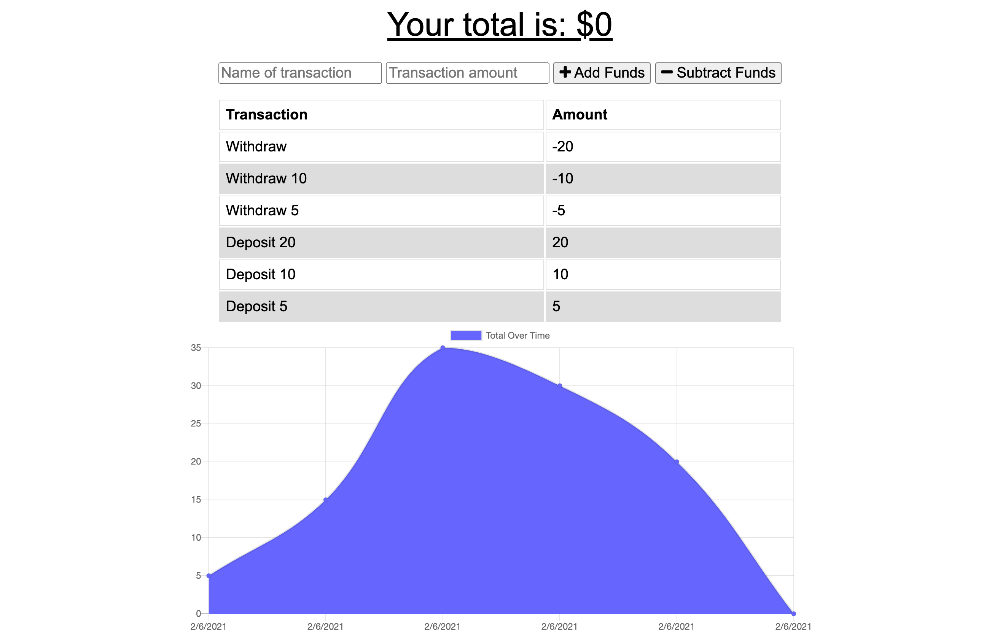

# Progressive-Budget-Tracker

-------------------------------------------------- Personal Notes -------------------------------------------------

Deployed Heroku App Link: https://eddiephi-progressive-budget.herokuapp.com/

Description:
I refactored this budget tracking app to have offline functionality. Users can input transactions off-network and have those transactions apply when they are on-network again. There is also a transactions chart provides a visual for transaction history.

Screenshot:

Technologies: JavaScript, Node, NPM, Express, mongoDB, Service Workers, Webpack, Web Manifests

License: MIT

I used https://validator.w3.org/nu/ to validate my work.

---------------------------------------------------- Contact ----------------------------------------------------

Email: ephimansone@gmail.com 

LinkedIn: https://linkedin.com/in/eddiephi

GitHub: https://github.com/EddiePhi

Portfolio: https://eddiephi.github.io/EddiePhiPortfolio/
